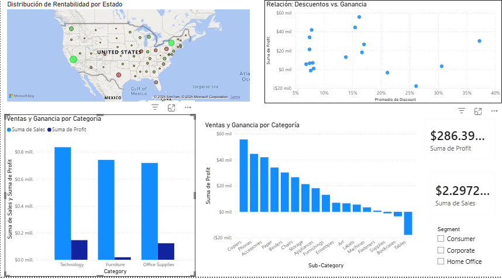
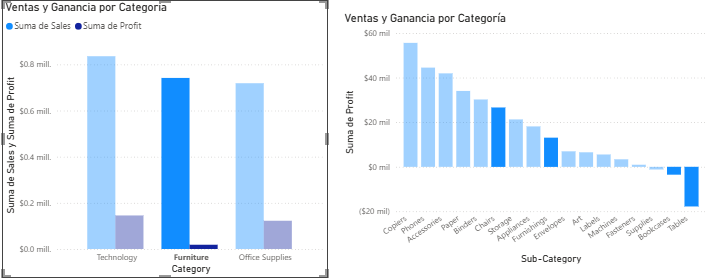
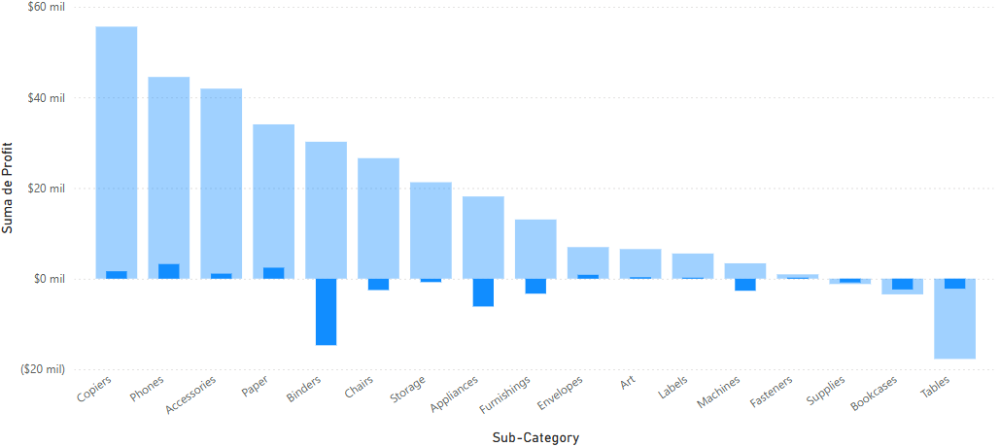
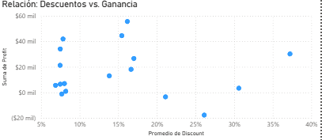

# Mas Ventas ≠ Mas Ganancia: El peligro del descuento excesivo

## Contexto del proyecto
Este proyecto analiza las ventas de un retail global para identificar por que, a pesar de tener  un alto volumen de ventas, la rentabilidad en ciertas regiones es critica, el objetivo fue transformar datos crudos en insights accionables para detener la fuga de dinero

## Hallazgos clave
* **Volumen vs Valor:*** Se detecto que categorias como *Furniture* generan grandes ingresos, pero margenes de ganancia minimos o negativos.

* **El Problema de Texas:** A traves del analisis geoespacial, se identifico a Texas como el estado con mayores perdidas (-25k), impulsado principalmente por la venta de *Tables* y *Binders*

* **La Trampa del descuento:** El analisis de dispersion revelo una correlacion directa: **descuentos superiores al 20% destruyen sistematicamente la rentabilidad**, independientemente del volumen de venta

## Herramientas utilizadas
* **Microsoft Excel:** Auditoria inicial y comprension del dataset
* **Power BI:**
    * Limpieza y transformacion de datos (ETL) con Power Query
    * Modelado de datos y creacion de medidas
    * Visualizacion interactiva 

## Conclusion y Recomendacion
Para recuperar la rentabilidad, se recomienda entablecer una politica de **tope maximo de descuento del 20%** en productos de la categoria *Furniture*, especialmente en la region central (Texas)